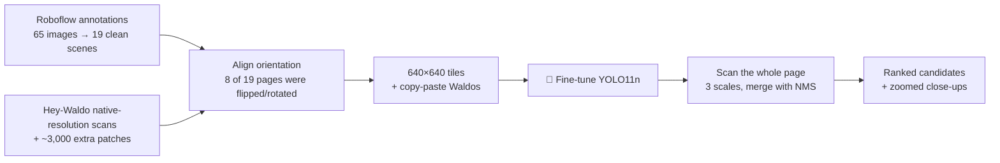
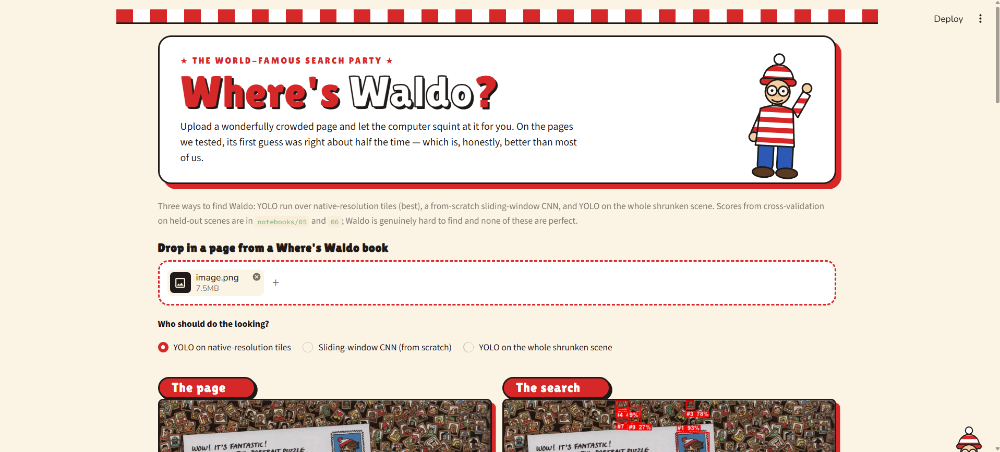
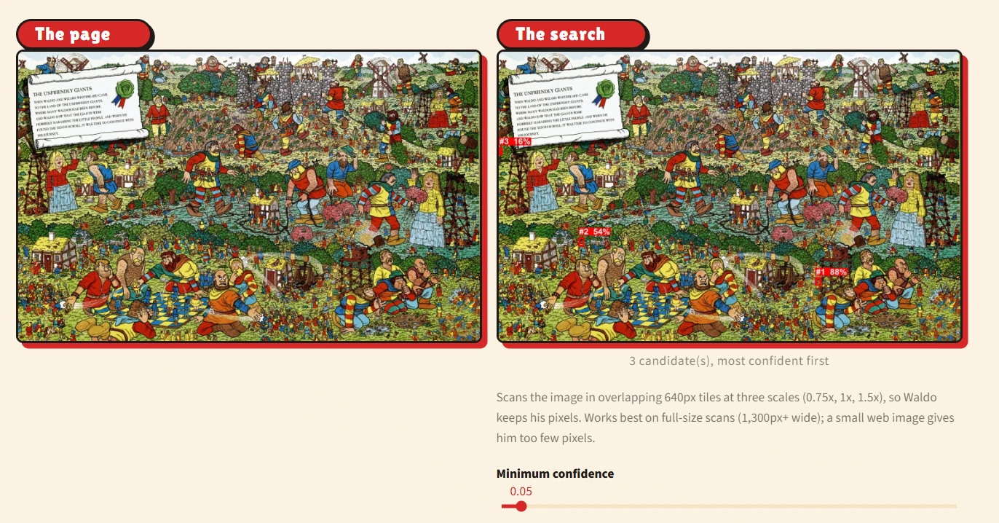
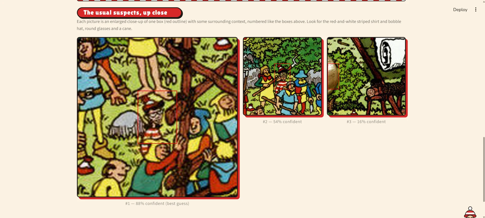
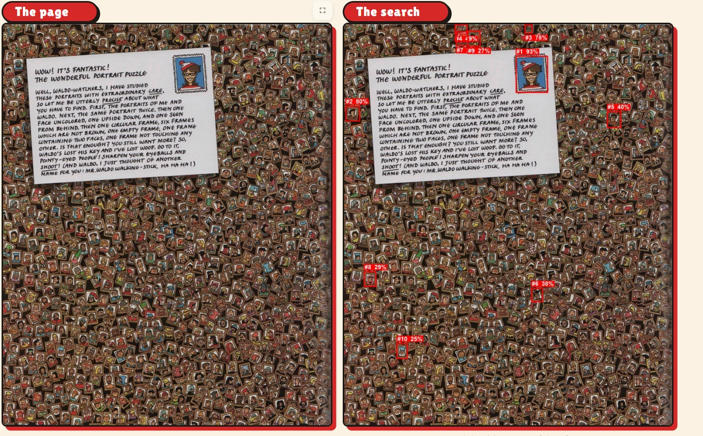
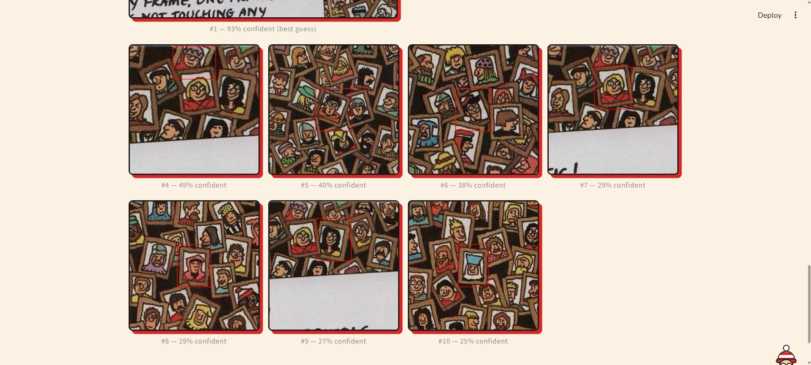

<h1 align="center">🔴⚪ Where's Waldo? 🔴⚪</h1>

<p align="center"><b>A computer-vision search party: teaching neural networks to spot the world's most elusive striped man.</b></p>

<p align="center">
  
  
  
  
  
</p>

<p align="center">
  <a href="https://wheres-waldo-finder.streamlit.app/"></a>
</p>

<p align="center">🔴⚪🔴⚪🔴⚪🔴⚪🔴⚪🔴⚪🔴⚪🔴⚪🔴⚪🔴⚪🔴⚪🔴⚪</p>

Waldo is about **0.14% of a page** and hides among hundreds of look-alikes. This project builds three detectors for
him, compares them honestly on pages they have never seen, and wraps the best one in a Streamlit app that shows you
**where to look** — as ranked, zoomed-in candidates.

- **A detector written from scratch** — sliding-window CNN, IoU and non-max suppression, all hand-implemented.
- **A fine-tuned YOLO11n** — first on the whole page, then on native-resolution *tiles* (the version that works).
- **Honest evaluation** — scene-level 5-fold cross-validation, thresholds chosen without peeking, small-sample
  caveats spelled out.
- **A detective story** — a data bug that hid in plain sight and was capping every result. (See
  [the case of the misplaced Waldos](#misplaced-waldos).)
- **A themed demo app** — upload a page, get the top suspects, each shown up close.
  **[Try it live](https://wheres-waldo-finder.streamlit.app/)** (free hosting: if nobody has visited for ~12 hours it
  sleeps and takes about a minute to wake up).

---

## Contents

[Results](#results) · [Field notes](#field-notes) · [How it works](#how-it-works) ·
[Quick start](#quick-start) · [Reproduce everything](#reproduce) · [The notebooks](#notebooks) ·
[Repo layout](#layout) · [Limitations](#limitations) ·
[Credits & licensing](#credits)

---

<a id="results"></a>

## Results at a glance

Everything is scored with **scene-level 5-fold cross-validation**: each of the 19 scenes is judged by a model that
never saw it in training (a box counts as a hit at IoU ≥ 0.3). There are **21 Waldo boxes in 18 scenes** that contain
him.

| Detector | Found | False alarms | Missed | Precision | Recall | Time / page* |
|---|---:|---:|---:|---:|---:|---:|
| Sliding-window CNN (from scratch) | 8 | 4,203 | 13 | 0.002 | 0.38 | ~4.3 s |
| YOLO11n, whole page shrunk to 640 px | 2 | 22 | 19 | 0.083 | 0.095 | ~0.12 s |
| YOLO11n, native-resolution **tiles** | 6 | 0 | 15 | 1.00 | 0.29 | ~1.8 s |
| YOLO11n, tiles, **multi-scale** | 7 | 14 | 14 | 0.33 | 0.33 | ~6 s |

<sub>*CPU-only laptop (AMD Ryzen 3 4300U). The first two timings are on the 640×640 page image, the tiled ones on
full-size scans. Precision/recall use a confidence threshold picked leave-one-fold-out (on the *other* four folds) —
the most conservative protocol here.</sub>

Because a puzzle page has exactly one Waldo, the most useful question is **"is he among the detector's top *k*
guesses?"** For the best detector (tiles, multi-scale), on the 18 held-out pages that contain him:

| Waldo is in the top… | 1 | 3 | 5 | 10 |
|---|---:|---:|---:|---:|
| **Pages (of 18)** | **10** (56%) | **13** (72%) | **13** (72%) | **14** (78%) |

That is why the demo shows **ranked candidates with close-ups** rather than a single confident box.

**What moved the needle:** not shrinking the page. Running YOLO on native-resolution tiles took it from 2 hits to
6–7. **What didn't:** hard-negative mining (no change) and, as far as one un-ablated experiment can say, copy-paste
synthetic data.

---

<a id="field-notes"></a>

## Field notes from actually using it

*Informal impressions from the author's own use of the demo — not a measured benchmark, and the demo's model was
trained on all 19 pages, so judge it on pages it hasn't seen.*

- Most of the time Waldo is in the **top 3** candidates; when he isn't, he is usually within the **top 10**.
- The most common false alarm is **Wenda** — which makes sense: she wears the same red-and-white stripes and
  glasses, so she is exactly the kind of look-alike this task punishes.
- Overall: good enough to point you at the right neighbourhood of the page, not good enough to trust blindly.
  Always check the close-ups.

---

<a id="how-it-works"></a>

## How it works



**Why tiles?** The public dataset ships every page stretched to 640×640, which squeezes Waldo to ~18×35 px (median) —
about one cell of YOLO11n's coarsest feature map. The original scans are 1,300–2,800 px wide, where he is ~50×60 px.
So the best detector never downscales: it trains on 640×640 native-resolution tiles (real Waldos at random offsets,
background tiles, and tiles with a Waldo crop from *another* training page pasted in) and, at inference, scans the whole
page with overlapping tiles at 0.75×, 1× and 1.5×, mapping the boxes back and merging duplicates with the project's own
hand-written NMS.

**The three detectors**

| | What it is | Why it's here |
|---|---|---|
| **Sliding-window CNN** | A 98k-parameter CNN that says "Waldo / not Waldo" for a 64×64 crop, slid across the page at 5 sizes | Built from scratch so IoU, NMS and windowing are visible in code, not hidden in a framework |
| **Whole-page YOLO** | YOLO11n fine-tuned on the page shrunk to 640×640 | The obvious framework baseline |
| **Tiled YOLO** | The same YOLO11n on native-resolution tiles, optionally at several scales | The fix for "Waldo is too small to see" — the best result |

---

<a id="quick-start"></a>

## Quick start

**Don't want to install anything?** Use the hosted version: **[wheres-waldo-finder.streamlit.app](https://wheres-waldo-finder.streamlit.app/)**.
It runs on a small free server, so very large uploads can occasionally fail — running it locally (below) has no such limit.

**Run the demo yourself** — the trained weights are included in `models/`, so there is nothing to train.

```bash
git clone https://github.com/VasilisVas1/wheres-waldo.git
cd wheres-waldo
python -m venv .venv
```
Activate the environment — on **Windows**:
```bash
.venv\Scripts\activate
```
or on **macOS / Linux**:
```bash
source .venv/bin/activate
```
Then install and launch:
```bash
pip install -r requirements.txt
```
```bash
streamlit run app/main.py
```

Your browser opens on `http://localhost:8501`. Then:

1. Pick **YOLO on native-resolution tiles** (the default).
2. Drop in a **full-size scan** of a Where's Waldo page (JPG/PNG, roughly 1,300 px wide or more — a small web image
   leaves Waldo too few pixels).
3. Click **Find Waldo!** (a few seconds on a CPU). You get numbered boxes on the page and an enlarged close-up of each
   candidate, the best guess largest. The two sliders re-filter the same scan instantly.
4. **Not seeing Waldo? Raise "Show at most this many candidates"** (up to 10) and look through the close-ups — he is
   not always in the first three. [Here's what that looks like.](#what-youll-see)

> **Test on a page the model hasn't seen.** The included tiled model was trained on all 19 pages of the dataset, so
> those pages will look better than they should.
>
> Run the app **from the project root** so the theme in `.streamlit/config.toml` applies. The headings use web fonts
> (Google Fonts); offline it falls back to plain system fonts.

<a id="what-youll-see"></a>

### What you'll see — and why "top 3" isn't always enough

<p align="center">
  
  <br><sub>Upload a page, pick a detector, click <b>Find Waldo!</b>. Boxes are numbered by confidence.</sub>
</p>

**Waldo is not always candidate #1.** On this page the best guess (88% confident) is Wenda not Waldo himself, but the second candidate is the real Waldo, the close-up makes him easy to confirm without zooming into the full page:

<p align="center">
  
  
</p>

**When it needs more candidates: Waldo isn't in the top 3.** This crowded page is covered in tiny look-alike portraits.
The very top guess (93%) is the Waldo portrait printed on the postcard stamp, and the hidden Waldo-style portraits
only appear further down the ranking — for example **#6 (38%)** wears a red-and-white bobble hat and round glasses.
Stop at three candidates and you'd miss it; raising the slider to 10 shows them all:

<p align="center">
  
  
</p>

So, in practice:

- **Start with the default 3.** That matches what we measured: Waldo is in the top 3 for about 72% of held-out pages
  (top 10: about 78%).
- **On busy or look-alike-heavy pages, raise the slider to 10** and scan the close-ups. Look for the red-and-white
  striped shirt and bobble hat, round glasses and a cane.
- **A high score is not a guarantee.** The confidence is the model's own score, not a probability — the stamp portrait
  above scores 93%, and look-alikes such as Wenda regularly score highly.
- **If fewer boxes appear than you asked for,** lower **Minimum confidence** (it defaults to 0.05).

---

<a id="reproduce"></a>

## Reproduce everything

The trained weights are committed, but every number in this README can be regenerated. It takes **roughly 9–10 hours
on a CPU-only laptop**, so it is designed to run unattended.

**1. Install** — same as above (`requirements.txt` includes Jupyter).

**2. Get the two datasets** (neither is redistributed here — see [Credits](#credits)):

| Dataset | What it provides | How |
|---|---|---|
| [Roboflow "where's waldo"](https://universe.roboflow.com/ml-9naud/where-s-waldo-vugud) (v1, Pascal VOC) | The bounding boxes | Free Roboflow account → accept the dataset terms → copy your API key → `cp .env.example .env` and paste it in. Notebook 01 downloads it automatically (or run `python -m src.data.download_dataset`). |
| [Hey-Waldo](https://github.com/vc1492a/Hey-Waldo) (also on [Kaggle](https://www.kaggle.com/datasets/residentmario/wheres-waldo)) | Full-resolution scans + ~3,000 labelled patches | Download and unzip it to `Hey-Waldo/` so that `Hey-Waldo/original-images/1.jpg … 19.jpg` and `Hey-Waldo/{64,128,256}/{waldo,notwaldo}/` exist. |

**3. Run the notebooks** — either interactively (`jupyter lab`, then work through `notebooks/01_…` to `06_…`), or all
at once in the background:

```bash
python run_all.py --detach       # notebooks 01 → 06 in order; stops at the first failure
python run_all.py --from 04      # resume from a notebook after an interruption
python run_all.py --only 05,06   # run just these
```

Progress goes to `logs/status.json` and `logs/<notebook>.log`. On Windows the runner keeps the machine awake (closing
the lid can still sleep it). Notebooks 04 and 05 skip folds that already finished training, so an interrupted run
resumes. Note that notebooks are executed **in place**: re-running overwrites the results currently stored in them.

**4. Check it works:** `python -m pytest tests` (8 tests covering the box-mapping maths behind the alignment fix).

<details>
<summary><b>Reproducibility notes</b> (seeds, expected variance, tested versions)</summary>

- Fold assignment: `KFold(n_splits=5, shuffle=True, random_state=42)` on scene ids. Patch and tile generation are
  seeded; PyTorch is seeded in notebook 03; YOLO uses ultralytics' default seed with `deterministic=True`.
- **Expect different numbers on a re-run**, especially for YOLO: with 21 boxes, a single detection changes a result a
  lot (the whole-page YOLO went from 4 hits to 2 between two runs of the same notebook). Rankings and the qualitative
  story are stable; exact counts are not.
- Developed and tested on **Windows 11, CPU only**. The notebooks pick a GPU automatically if `torch.cuda` is
  available (untested here). macOS/Linux should work; the runner's keep-awake step is Windows-only.
- Versions used for the results above:

| Python | torch | torchvision | ultralytics | streamlit | numpy | pandas | scikit-learn | albumentations | Pillow |
|---|---|---|---|---|---|---|---|---|---|
| 3.10.1 | 2.14.0 | 0.29.0 | 8.4.154 | 1.64.0 | 2.2.6 | 2.3.3 | 1.7.2 | 2.0.8 | 12.3.0 |

`requirements.txt` gives minimum versions rather than pins; the code uses the albumentations **2.x** API.

</details>

---

<a id="notebooks"></a>

## The notebooks

Each notebook is written as a narrative: *what we're testing, why, what we saw, and what it means for the next step.*
They are saved **with their outputs**, so you can read the whole story on GitHub without running anything.

| # | Notebook | What happens | CPU time |
|---|---|---|---|
| 01 | `01_data_exploration` | What the data really is: Waldo's size, extreme class imbalance, and a leakage check. Discovers that most of the 65 "scenes" are unrelated portrait close-ups → 19 clean scenes | minutes |
| 02 | `02_preprocessing` | Scene-level 5-fold split, patch corpus, augmentation; **Part 2:** Hey-Waldo patches, aligning the native scans (the [orientation bug](#misplaced-waldos)), copy-paste synthetic data | ~1 min |
| 03 | `03_train_sliding_window` | The from-scratch CNN + sliding window + NMS; threshold sweep; hard-negative mining (which didn't help) | ~35 min |
| 04 | `04_train_yolo` | Whole-page YOLO11n baseline across 5 folds, scored with the same metrics as 03 | ~4 h |
| 05 | `05_tiled_yolo` | **The main result:** native-resolution tiles, multi-scale scanning, leave-one-fold-out thresholds, hit@k | ~5 h |
| 06 | `06_evaluation_error_analysis` | Side-by-side comparison, failure modes, and the full write-up | < 1 min |

*Some notebooks refer to "the project brief" — that is the original assignment description this project started from.*

---

<a id="misplaced-waldos"></a>

## The case of the misplaced Waldos

Notebook 05's first attempt looked… bad. Waldo landed in the top 10 for only **4 of 18** pages, and the model's most
*confident* "false positives" turned out to be striking Waldo look-alikes. Something was off with the labels, not the
model.

The culprit: the annotated dataset's export had **flipped or rotated 8 of the 19 pages** relative to the full-resolution
scans. Mapping its boxes onto the scans by rescaling alone put the "ground truth" on a policeman, a letter and a red
panel. A spot-check of four random pages had happened to draw only unaffected ones.

The fix (`src/data/native_manifest.py`): for each page, compare the annotated image against all 8 flips/rotations of the
scan by image correlation (≈ 0.99 for the right one, ≤ 0.75 for every wrong one), refuse to continue without a clear
winner, and map each box back through the inverse transform. `tests/test_native_alignment.py` checks the maths against
real image transforms for all 8 cases, and notebook 02 now displays **every** box.

Result with the *identical* training recipe: **4 → 10 of 18** pages with Waldo in the top 10. The lesson is written into
notebook 06: verify labels on every example, not a sample.

---

<a id="layout"></a>

## Repository layout

```
.
├── notebooks/        six narrative notebooks (01 → 06), saved with outputs
├── src/
│   ├── data/         loading, patches, augmentation, native-scan alignment, synthetic data, tiling
│   ├── models/       sliding-window CNN and its training loop
│   └── eval/         hand-written IoU / NMS and the detection metrics
├── app/              Streamlit demo (main.py) and its Where's-Waldo theme (waldo_theme.py)
├── tests/            unit tests for the box mapping behind the alignment fix
├── docs/images/      app screenshots used in this README
├── models/           trained weights (~11 MB) + the tiled detector's config
├── .streamlit/       theme colours for the demo
├── run_all.py        run the notebooks unattended, in order
├── .env.example      template for the Roboflow API key
├── requirements.txt
└── LICENSE           MIT
```

Generated at run time and not committed: `data/` (raw + processed), `Hey-Waldo/`, `runs/` (training runs), `logs/`.

---

<a id="limitations"></a>

## Limitations (read before trusting anything)

- **Tiny evaluation set.** 21 boxes in 18 scenes: every number has wide error bars, and single detections swing results.
- **Multi-scale was chosen on the test pages.** The scale set (0.75/1/1.5) was picked from four variants using the same
  held-out scenes, so its numbers are somewhat optimistic. Single-scale tiles are the untuned reference.
- **The demo's model can't be scored.** It is trained on all 19 pages, so nothing is held out; the cross-validated
  numbers are the estimate of how it should behave on new pages.
- **Some "Waldos" aren't hidden.** Three annotated boxes are Waldo *portraits on postcard stamps*, not hidden figures.
- **Misses I haven't explained.** Pages 2, 3 and 13 are never found (nothing matching Waldo at confidence ≥ 0.01), and
  page 7 only at rank 36.
- **Look-alikes** (Wenda in particular) are a frequent false alarm — see the field notes above.
- **Weak baselines by design.** The sliding-window CNN buries Waldo under ~220 false boxes per page, and the whole-page
  YOLO is noisy run to run; they exist to show *why* the tiled approach matters.
- **No ablations.** For example, whether copy-paste synthetic data helps was not isolated.
- **Input size matters.** Small or low-resolution uploads give Waldo too few pixels for any of the detectors.

---

<a id="credits"></a>

## Credits & licensing

- **Code:** [MIT](LICENSE).
- **Where's Waldo? / Where's Wally?** is created by Martin Handford and published by Walker Books / Candlewick Press.
  This is an **unofficial, educational project** with no affiliation. **The datasets (the page scans) are not distributed
  in this repository** — you obtain them yourself. The saved notebook outputs and the app screenshots in
  `docs/images/` do show reduced-size book pages, close-ups and detection overlays, purely to illustrate the results; if
  you are a rights holder and would like them removed, please open an issue.
- **Data:** annotations from the ["where's waldo" project](https://universe.roboflow.com/ml-9naud/where-s-waldo-vugud) by
  *ml-9naud* on Roboflow Universe (CC BY 4.0); full-resolution scans and extra patches from
  [Hey-Waldo](https://github.com/vc1492a/Hey-Waldo). Please follow each dataset's own terms.
- **Models:** the YOLO weights in `models/` are fine-tuned from Ultralytics **YOLO11n**, which is licensed under
  **AGPL-3.0**; the demo also uses the Ultralytics library. If you build on them (for example by hosting a modified
  version as a network service), review the [Ultralytics license](https://github.com/ultralytics/ultralytics/blob/main/LICENSE).
  The sliding-window CNN weights are original to this project.
- **Built with:** PyTorch, Ultralytics, albumentations, scikit-learn, pandas, Streamlit and Jupyter.

<p align="center">🔴⚪🔴⚪🔴⚪🔴⚪🔴⚪🔴⚪🔴⚪🔴⚪🔴⚪🔴⚪🔴⚪🔴⚪</p>
